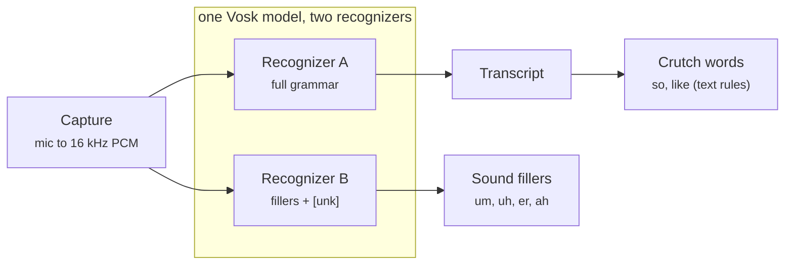

# toastmaster-auto-ah-counter

A live, browser-only web app that listens to Toastmasters speakers and counts
their filler words ("um," "uh," "like," "so"…) in real time with animated
per-speaker counters and a streaming transcript.

**Live app:** https://nirajkmr007.github.io/toastmaster-auto-ah-counter/

Chrome or Edge, allow microphone access when prompted. First load fetches the
~40 MB Vosk model — subsequent starts are instant.

## Design at a glance

- **Client-only.** No backend. One tab does audio capture, STT, and filler
  detection locally. Session state lives in memory and dies when the tab
  closes — nothing is stored or uploaded.
- **One mic, a roster of speakers.** The operator (the ah-counter) runs a
  single tab and taps who's speaking now as the meeting moves. Each speaker
  accumulates their own counts, transcript, and speaking time; the end-of-
  session report has a section per speaker. (A multi-device sync mode is
  parked — see roadmap.)
- **Two recognizers, one model.** A single Vosk model drives two recognizers
  fed the same audio: **A** (full grammar) produces the transcript and the
  crutch words (`so`, `like`, `actually`); **B** (grammar restricted to filler
  sounds + `[unk]`) is a dedicated sound-filler detector for `um/uh/er/ah/hmm`.
  This sidesteps the recall-vs-precision tuning of a single model — A keeps
  English quality, B specializes in the hesitations A smooths over. No offline
  model tuning.
- **Filler detection.** Sound fillers come straight from recognizer B
  (canonicalized to one label). Crutch words come from text rules on A's
  transcript: context rules (`so` at utterance start, `like` unless a
  verb/simile/infinitive) + a rolling frequency threshold, with per-word
  sensitivity (Extra strict / Strict / Balanced / Loose). The operator can add
  or correct any count manually.
- **UI.** Two boxes. Left: crutch-word bubbles + the streaming transcript.
  Right: sound-filler bubbles. Each bubble has −/+/× to fix miscounts. A
  per-speaker speech timer shows a green/yellow/red signal.
- **Noise cancellation.** Browser-native `noiseSuppression` + `echoCancellation`
  via `getUserMedia`.

## Stack

- Vite + React 19 + TypeScript
- Zustand — local state (speaker roster + session)
- Framer Motion — bubble / report animations
- vosk-browser — streaming STT (two recognizers off one model)
- html-to-image — PNG export of the session report

## How your voice becomes a counted filler

The path from a spoken "um" to a bubble on screen, and who owns each step:



The same audio is fed to both recognizers. A is a normal transcriber; B has
its grammar restricted to filler sounds, so it is forced to output a filler or
`[unk]` — catching the `um`/`uh` that A tends to smooth into real words. Sound
fillers come only from B; crutch words come only from A's transcript. No
offline model tuning is involved.

## Getting started

Requires Node.js 20+ and a Chromium browser (mic access). Then:

```bash
npm install
npm run dev        # http://localhost:5173
```

`./setup.sh` is an optional helper that installs Node via Homebrew/apt if you
don't already have it, then runs `npm install`.

Useful scripts: `npm run build` (type-check + production build), `npm run
preview` (serve the build), `npm run lint` (oxlint).

## Speech recognition (two recognizers)

There's one model — the ~40 MB `vosk-model-small-en-us-0.15`, fetched from a
CDN on first load and browser-cached. It powers two recognizers created from
`src/audio/voskEngine.ts`:

- **Recognizer A** — full grammar. Produces the live transcript; the crutch
  words (`so`, `like`, `actually`, `you know`) are found by text rules in
  `src/detection/detector.ts`.
- **Recognizer B** — grammar restricted at runtime to the filler sounds plus
  `[unk]` (Vosk's `KaldiRecognizer(rate, grammar)`). It can only emit a filler
  sound or `[unk]`, so it reliably catches the `um`/`uh`/`er`/`ah` that the
  full model tends to turn into real words.

Both are fed the same audio. This is why there's no offline model tuning and no
recall/precision knob to fight: A handles English, B specializes in sounds. The
filler-sound list (recognizer B's grammar) and the crutch words are both edited
in the ⚙ **Manage filler words** panel.

### Clean transcript (profanity masking)

Because recognizer A runs the model's full open vocabulary, a nonverbal burst —
a throat clear, a plosive into the mic, a long `ahh` — occasionally decodes as a
short profane word that nobody said. This tool gets used in corporate meetings
and on shared screens, so `src/detection/profanity.ts` masks a configurable list
of words to `***`.

The mask is applied **at ingestion**, before the text reaches the store, so
nothing profane ever lands in the transcript pane, the report, the exported PNG
or the copied session log. It's token-preserving (one word → one `***`), which
keeps crutch-word highlight positions aligned, and it matches whole tokens only
— `class`, `assume` and `passage` are never touched. Filler counting is
unaffected: sound fillers come from recognizer B, whose grammar can't produce
profanity in the first place.

The list is editable under ⚙ → **Clean transcript** (defaults to strong
profanity only; mild words like "damn" are left verbatim). Clearing it gives a
fully verbatim transcript.

## Deploy (GitHub Pages)

The app is a fully static bundle, so any static host works. This repo ships a
GH Pages workflow (`.github/workflows/deploy.yml`) that builds and publishes
on every push to `main`. One-time setup:

1. Push the repo to GitHub as **public** at
   `github.com/<you>/toastmaster-auto-ah-counter`.
2. **Settings → Pages → Source: GitHub Actions** (not "Deploy from a branch").
3. Push to `main`. The workflow builds, uploads `dist/`, and deploys to
   `https://<you>.github.io/toastmaster-auto-ah-counter/`.

Notes:

- The subpath is hard-coded in `vite.config.ts` (`base: '/toastmaster-auto-ah-counter/'`
  for `build`; dev stays at `/`). If you rename the repo, update it there.
- HTTPS is automatic — required, because `getUserMedia` won't work over HTTP.
- The Vosk model (~40 MB) is fetched from `ccoreilly.github.io` on first Start.
  If that origin ever goes down, self-host it: drop the `.tar.gz` under
  `public/models/` and point `MODEL_URL` in `src/audio/models.ts` at
  `${import.meta.env.BASE_URL}models/...`.

## Roadmap

**Built**
- Two recognizers off one Vosk model: full transcript (A) + restricted
  sound-filler grammar (B). No offline model tuning.
- One-mic multi-speaker sessions: add a roster, tap the active speaker, per-
  speaker counts / transcript / speaking time.
- Sound fillers from recognizer B; crutch words from rule-based text detection
  on A (context + frequency rules, sensitivity levels).
- Configurable word lists (⚙ Manage filler words), manual add + −/+/× fixes.
- Per-speaker speech timer with green/yellow/red signal.
- Two-box UI: crutch words + transcript | sound fillers. Consolidated
  end-of-session report with PNG export.

**Parked**
- Multi-device mode: each speaker on their own device, synced via Yjs/WebRTC
  (would need a signaling server — trades away the zero-backend property).
- RNNoise-WASM for stronger noise cancellation.
- LLM-based crutch classifier for higher crutch-word precision.

**Removed in v2 (recoverable from the `v1.0.0` tag)**
- CrisperWhisper / transformers.js engine.
- Offline LM-adaptation toolchain (`scripts/lm-adapt/`) and extra Vosk models
  (lgraph, Indian English). The dual-recognizer design made them unnecessary.

## Contributing

See [CONTRIBUTING.md](CONTRIBUTING.md) for setup, scripts, project structure,
and the mental model of the two-recognizer design. Short version: Node 20+,
`npm install`, `npm run dev`; keep it backend-free and session-only.

## License

[MIT](LICENSE).
